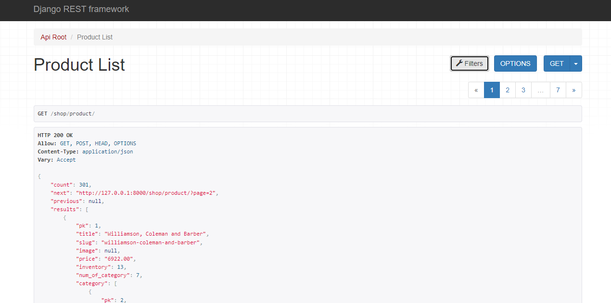

# Shop Api

A django project using dajngo-rest-framework for developing apis for a shop project




## Table of Contents

- [Installation](#installation)
- [Usage](#usage)
- [API Documentation](#api-documentation)
- [Contributing](#contributing)
- [License](#license)

## Installation

To set up the project locally, follow these steps:

1. Clone the repository:
    ```bash
    git clone https://github.com/rms82/drf_shop.git
    cd drf_shop
    ```

2. Create and activate a virtual environment (recommended):
    ```bash
    docker-compose up --build
    #if you want venv use code below
      #python -m venv venv
      #source venv/bin/activate


## API Documentation

Our project offers a comprehensive API for various functionalities. You can interact with these APIs to perform tasks related to our application.


### Base URL

- All API endpoints are accessible at: `/swagger`


